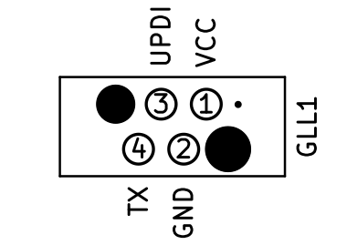

# GLL1 - UPDI programming interface connector

This document describes the UPDI programming interface connector specification with the name GLL1. 

## What is it for?

It aims to be a cost effective hands free UPDI connector interface for programming ATtiny Microchip MCUs. 

## Why does it exist?

Many designs rela on 2.54mm pinheaders or bulky connectors. 
They are either not very reliable or pleasant to work with or are big and "expensive" to use for each board. 
For this reasons the [WR-WST REDFIT IDC SKEDD](https://www.we-online.com/en/components/products/REDFIT_IDC_SKEDD) connetor is used. 

## How does it work?

The cable from the programmer (VCC{: .text-red-300}-UPDI{: .text-blue-200}-GND) will have the connector and the PCB will only need a footprint. 
So there is no need for a connector on the PCB itself (reducing cost and assembly time).
Additionally it supports, as we have one pin free, the TX of the UART.
Thias can be used to serial "debug" the MCU. 

### pinout

### connector

The connector on the cable is a [**Würth - 490107670412**](https://www.we-online.com/en/components/products/REDFIT_IDC_SKEDD) and can be found at the major electronic component distributors such as DigiKey, Mouser, Farnell, etc. 

### footprint

The footprint is designed according to the [**ANE011**](https://www.we-online.com/components/media/o210254v410%20ANE011b_EN.pdf) of Würth Elektronik with the **Debug connector** layout. 

# Cabling colours (optional)

The colours of the cabling to the connetor is not too important, as the connector only makes in the correct positions contact. 
For good practice and to make it more abvois for the user, the following colours should be used. 

VCC - red 
{: .text-red-300}

GND - black 
{: .text-grey-dk-300}

UPDI - blue
{: .text-blue-200}

TX - green (optional)
{: .text-green-200}

# pros and cons

This approach has, as always, pros and cons. 
It should be considered if these a acceptable for your project or situation. 

## pros
- hands free as the connector is self clamping
- cheap on the target side (no additional component)
- Reverse polarity protected
- no crimping tool needed (atleast not in low quantities or home lab use)

## cons
- big footprint compared to 
  - TagConnect 
  - 3x1 2.54mm or 
  - 1.27 pinheader
- Troughthole for all pins
- connector only rated for 50 cycles (aspite questionable for this perpose)

# Usefull Links and Tools

[SKEDD connector press tool](https://www.thingiverse.com/thing:6157896)
[Datasheet](https://www.we-online.com/components/products/datasheet/490107670412.pdf)

# alternative connector ideas

A non comprehensible list of connectors for this purpose:
- ATMEL ICE - UPDI 6 pin header
- [AVR UPDI headers](https://microchip.my.site.com/s/article/ATMEL-ICE---UPDI-6-pin-header-internal-connections-during-programing) - MCUdude
- [1.27mm self-clamping zigzag](https://avdweb.nl/arduino/attiny3217/ftdi-updi-connector) - avdweb
- 3 pin 2.54mm header (VCC-UPDI-GND) or any combination
